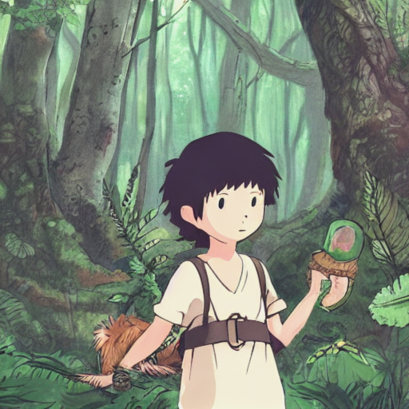

---

# 🚀Ghibli Image Generator

  
*Generate Studio Ghibli-style images from text prompts or user-uploaded images!*

The Ghibli Image Generator is a web-based tool that transforms text prompts or uploaded images into artwork inspired by the iconic Studio Ghibli style. It uses a combination of Stable Diffusion for text-to-image generation and post-processing techniques to achieve the soft colors, detailed backgrounds, and hand-drawn aesthetic characteristic of Ghibli films. The project is built with Flask for the web interface and can be deployed on Hugging Face Spaces for easy access.

## Features
- **Text-to-Image Generation**: Enter a text prompt to generate a Ghibli-style image.
- **Image-to-Image Transformation**: Upload an image and convert it into the Ghibli style.
- **Web Interface**: A user-friendly Flask-based interface for interaction.
- **Hugging Face Spaces Deployment**: Easily deploy and share the app online.
- **Customizable**: Modify the style transfer and post-processing to fine-tune the Ghibli aesthetic.

## Demo
A live demo is available on Hugging Face Spaces: [Ghibli Image Generator Demo](https://huggingface.co/spaces/your-username/ghibli-image-generator) 

## Installation

### Prerequisites
- Python 3.8 or higher
- A GPU (recommended for faster image generation with Stable Diffusion)
- An account on Hugging Face for deployment

### Local Setup
1. **Clone the Repository**
   ```bash
   git clone https://github.com/Adiwanwade/Ghibli-Generator.git
   cd ghibli-image-generator
   ```

2. **Create a Virtual Environment**
   ```bash
   python -m venv venv
   source venv/bin/activate  # On Windows: venv\Scripts\activate
   ```

3. **Install Dependencies**
   ```bash
   pip install torch torchvision torchaudio
   pip install diffusers transformers
   pip install flask pillow accelerate
   ```

4. **Set Up the Directory Structure**
   Ensure the following structure exists:
   ```
   ghibli-image-generator/
   ├── app.py
   ├── static/
   │   ├── uploads/
   ├── templates/
   │   ├── index.html
   ├── requirements.txt
   ├── README.md
   ```

5. **Run the Application Locally**
   ```bash
   python app.py
   ```
   Open your browser and go to `http://127.0.0.1:5000` to access the app.

## Usage

### Text-to-Image Mode
1. Open the app in your browser.
2. In the "Text Prompt" section, enter a description (e.g., "A young adventurer in a lush forest with a magical creature").
3. Click "Generate Image" to create a Ghibli-style image.
4. Download the generated image using the "Download Image" button.

### Image-to-Image Mode
1. Open the app in your browser.
2. In the "Upload Image" section, select an image from your device.
3. Click "Convert to Ghibli Style" to transform the image.
4. Download the converted image using the "Download Image" button.

## Project Structure
- `app.py`: The main Flask application with routes for text-to-image and image-to-image generation.
- `static/uploads/`: Directory to store generated and uploaded images.
- `templates/index.html`: HTML template for the web interface.
- `requirements.txt`: List of Python dependencies for deployment.

## Contributing
Contributions are welcome! To contribute:
1. Fork the repository.
2. Create a new branch (`git checkout -b feature/your-feature`).
3. Make your changes and commit (`git commit -m "Add your feature"`).
4. Push to your branch (`git push origin feature/your-feature`).
5. Open a pull request.

## License
This project is licensed under the MIT License. See the [LICENSE](LICENSE) file for details.

## Acknowledgments
- [Stable Diffusion](https://github.com/CompVis/stable-diffusion) by CompVis for the text-to-image model.
- [Hugging Face](https://huggingface.co/) for hosting and deployment.
- Studio Ghibli for the inspiration behind this project.

## Contact
For questions or feedback, reach out to [Adiwanwade@gmail.com](mailto:adiwanwade@gmail.com) or open an issue on GitHub.

---

This README provides a comprehensive guide for users and contributors. You can customize the links, demo URL, and contact information to match your actual setup. Let me know if you'd like to add more sections or details!